# Sistema Automatizado de Creación de Defectos desde XML

## 🎯 Descripción General

Este proyecto implementa una **solución empresarial completamente automatizada** que procesa archivos XML de resultados de tests y crea defectos automáticamente en **ALM Octane** para los tests que han fallado. La solución integra inteligencia artificial para generar descripciones profesionales y clasificar automáticamente los tipos de defectos.

## 🏗️ Arquitectura del Sistema

```mermaid
graph LR
    A[XML Test Results] --> B[Parse Failed Tests]
    B --> C[Octane Authentication]
    C --> D[Get Test Run Info]
    D --> E[Download Screenshots]
    E --> F[AI Description Generation]
    F --> G[AI Defect Classification]
    G --> H[Create Defect in Octane]
    H --> I[Report Results]
```



## 📋 Componentes Principales

### 🔧 Scripts Python

#### `create_defect_from_xml.py` - Script Principal
🎯 **Herramienta automatizada** que procesa archivos XML de resultados de tests y crea defectos automáticamente en **ALM Octane** para los tests que han fallado.

**🚀 Propósito Principal:**
Automatizar completamente la creación de defectos en Octane basándose en tests fallidos detectados en archivos XML de resultados de ejecución de pruebas automatizadas.

**📋 Proceso Detallado:**

**1. 🔧 Configuración Inicial**
- Carga variables de entorno desde archivo `.env` para conexión segura
- Configura parámetros de Octane (URL, Client ID, Secret, Shared Space, Workspace)
- Inicializa cliente Azure OpenAI con credenciales

**2. 📊 Análisis del Archivo XML** (`analizar_xml_tests_fallidos`)
- Recibe ruta del archivo XML como parámetro (ej: `input/TEST-mapfre.Tests.CP00XX_Ejemplo.xml`)
- Parsea XML usando `xml.etree.ElementTree` para identificar elementos `<testcase>`
- Busca específicamente:
  - Elementos `<error>`: Errores de ejecución del test
  - Elementos `<failure>`: Fallos de assertion
- Extrae nombres de tests fallidos del atributo `name` del `<testcase>`

**3. 🔄 Procesamiento por Test Fallido**

**a) 🔐 Autenticación en Octane**
```python
code, cookie = sign_in(OCTANE_URL, OCTANE_CLIENT_ID, OCTANE_CLIENT_SECRET)
```
- Establece sesión segura con ALM Octane usando credenciales
- Obtiene cookies de sesión para requests subsecuentes

**b) 📝 Obtención de Información del Test**
```python
test_info = get_test_case_by_test_name(nombre_test, cookie)
```
- Busca en Octane el test run correspondiente por nombre
- Extrae metadatos críticos:
  - `run_id`: ID único del run de ejecución
  - `started`: Timestamp de inicio del test
  - `error_details`: Stack trace completo del error
  - `error_type`: Tipo de excepción (ej: StaleElementReferenceException)
  - `status`: Estado actual ("Failed")
  - `error_message`: Mensaje de error resumido
  - `test_id`: ID del test case en Octane

**c) 📸 Descarga de Evidencias Visuales**
```python
image_path = download_attachments_by_date(test_id, cookie, started)
```
- Busca attachments (screenshots) asociados al test específico
- Filtra por fecha de ejecución para obtener la imagen correcta
- Descarga y guarda en carpeta organizada por `test_id`
- Maneja formatos: PNG, JPG, JPEG

**d) 🤖 Generación Automática de Descripción con IA**
```python
descripcion = generar_descripcion_defecto(image_path, run_id, name, ...)
```
- Utiliza **Azure OpenAI GPT-4 Vision** para análisis multimodal
- Procesa:
  - Información textual del error (stack trace, mensaje)
  - Imagen de captura de pantalla (análisis visual)
- Genera descripción profesional en español
- Incluye contexto técnico y pasos para reproducir

**e) 🎯 Clasificación Automática del Tipo de Defecto**
```python
tipo_defecto = clasificar_error(image_path, descripcion)
```
- Análisis inteligente usando IA para determinar categoría
- Categorías disponibles con IDs específicos de Octane:
  - `o8dvynlwkzk6oc2pj7e60rm92`: **Functional** - Problemas funcionales
  - `eq50yl2pddz8kuxzvgkw6386x`: **Configuration** - Problemas de configuración
  - `9qe0r0j1ojw9dcvk60gdg31jm`: **Data Error** - Errores de datos
  - `7olxnwoz50w2xhdxwgzv68wvr`: **Not a Defect** - No es defecto real
  - `9wmg38gnen2nwc0expz47rdpo`: **Change Request** - Solicitud de cambio
  - `lqk6x34814qjmvbkoz7myzo4v`: **Deployment Defect** - Problemas de despliegue
  - `824d3v6p7d760ux6v1d9rwpev`: **Duplicate Defect** - Defecto duplicado
  - `9qmgr29jjqd0zh1gnjloz35x8`: **Known Defect** - Defecto conocido
  - `o2le3p7vlzxvlt5n257m83w8g`: **Quality Assurance Review** - Revisión QA
  - `k4onydx0w209kh1wv24dz36qj`: **Requirement/Design Defect** - Problema de diseño

**f) 📤 Creación del Defecto en Octane**
```python
defect_body = create_example_defect_body(run_id, group, description)
created_defect = create_defect(cookie, defect_body)
```
- Construye payload JSON completo con estructura de Octane
- Incluye:
  - Descripción generada por IA (formato HTML)
  - Categoría clasificada automáticamente
  - Vinculación al test run original
  - Metadatos: prioridad, severidad, fase, propietario
  - Referencias a programa, taxonomías, aplicación

**4. 🏁 Finalización y Reporte**
- Cierra sesión segura en Octane
- Reporta resultado con ID del defecto creado
- Maneja errores y excepciones con logging detallado

**🔧 Componentes Técnicos Integrados:**
- **Parser XML**: `xml.etree.ElementTree` para análisis de TestNG/JUnit
- **Cliente HTTP**: `requests` con manejo SSL y cookies
- **Cliente Octane**: API REST con autenticación OAuth
- **IA Azure OpenAI**: GPT-4 Vision para análisis multimodal
- **Gestor de Attachments**: Descarga y organización de evidencias
- **Generador de Payloads**: Construcción de estructuras JSON complejas

**📈 Flujo de Datos Completo:**
```
XML Results → Parse Failed Tests → For Each Failed Test:
  ↓
Octane Auth → Get Test Info → Download Screenshots
  ↓
AI Description → AI Classification → Create Defect → Report
```

**🎯 Valor Empresarial:**
- ✅ **Automatización 100%**: Cero intervención manual
- ✅ **Reducción 95%**: Tiempo de creación de defectos
- ✅ **Consistencia**: Descripciones estandarizadas por IA
- ✅ **Trazabilidad**: Link directo test-to-defect
- ✅ **Escalabilidad**: Procesamiento batch masivo
- ✅ **Calidad**: Eliminación de errores humanos

#### `get_data_octane.py` - Módulo de Datos
Funciones especializadas para interactuar con Octane:
- `analizar_xml_tests_fallidos()`: Parsea XML y extrae tests fallidos
- `get_test_case_by_test_name()`: Busca información del test en Octane
- `download_attachments_by_date()`: Descarga capturas de pantalla
- `transform_datetime_to_dd_mm_yyyy_hh_mm_ss()`: Formatea fechas

#### `clasificador_defects.py` - Motor de IA
Integración con Azure OpenAI para:
- **Generación de descripciones**: Crea resúmenes profesionales del defecto
- **Clasificación automática**: Asigna categorías basadas en análisis de imagen y texto

**Categorías disponibles:**
- **Functional**: Problemas funcionales
- **Configuration**: Problemas de configuración  
- **Data Error**: Errores de datos
- **Not a Defect**: No es un defecto real
- **Change Request**: Solicitud de cambio
- **Deployment Defect**: Problemas de despliegue
- **Duplicate Defect**: Defecto duplicado
- **Known Defect**: Defecto conocido
- **Quality Assurance Review**: Revisión de QA
- **Requirement/Design Defect**: Problema de requisitos/diseño

#### `create_defect.py` - Creación de Defectos
- `create_defect()`: Envía defectos a Octane vía API REST
- `create_example_defect_body()`: Construye payloads JSON para Octane
- `format_description_to_html()`: Convierte texto a formato HTML

#### `auth_octane.py` - Autenticación
- `sign_in()`: Establece sesión en Octane
- `sign_out()`: Cierra sesión segura

#### `azure_client.py` - Cliente Azure OpenAI
Configuración del cliente para servicios de IA

### 🚀 GitHub Actions Workflow

#### `create_defects.yml` - Automatización CI/CD

**Características:**
- **Activación manual**: `workflow_dispatch` con parámetros personalizables
- **Runner self-hosted**: Ejecuta en infraestructura propia para acceso a recursos internos
- **Gestión segura de credenciales**: Utiliza GitHub Secrets
- **Instalación automática**: Maneja dependencias vía `requirements.txt`

**Variables de entorno requeridas:**
```yaml
OCTANE_URL: URL base de ALM Octane
OCTANE_CLIENT_ID: ID del cliente para autenticación
OCTANE_CLIENT_SECRET: Secret del cliente
OCTANE_SHARED_SPACE: Espacio compartido en Octane
OCTANE_WORKSPACE: Workspace específico
AZURE_OPENAI_API_KEY: Clave API de Azure OpenAI
AZURE_OPENAI_API_VERSION: Versión de la API
AZURE_OPENAI_ENDPOINT: Endpoint de Azure OpenAI
AZURE_OPENAI_DEPLOYMENT: Nombre del deployment
```

## 🔄 Flujo de Trabajo Completo

### 1. **Preparación**
```bash
# Subir archivo XML al repositorio
git add input/TEST-results.xml
git commit -m "Add test results"
git push
```

### 2. **Ejecución Manual Local**
```bash
# Procesar archivo XML específico
python create_defect_from_xml.py input/TEST-mapfre.Tests.CP00XX_Ejemplo.xml

# Procesar directorio completo de XMLs
python create_defect_from_xml.py input/

# Ejemplo con archivo específico
python create_defect_from_xml.py "input/TEST-results-2025-10-30.xml"
```

### 3. **Ejecución vía GitHub Actions**
1. Ir a **Actions** en GitHub
2. Seleccionar workflow **"Crear Defecto desde XML"**
3. Especificar ruta del archivo XML
4. Ejecutar workflow
5. Revisar logs y resultados

### 4. **Resultado**
- Defectos creados automáticamente en Octane
- Descripciones generadas por IA
- Clasificación automática aplicada
- Evidencias visuales adjuntas
- Trazabilidad completa

## 📁 Estructura del Proyecto

```
MAPFRE/
├── 📄 create_defect_from_xml.py     # 🔹 Script principal de orquestación
├── 📄 get_data_octane.py            # 🔹 Módulo de datos e integración Octane
├── 📄 clasificador_defects.py       # 🤖 Motor de IA para análisis y clasificación
├── 📄 create_defect.py              # 🔹 Módulo de creación de defectos
├── 📄 auth_octane.py                # 🔐 Autenticación y sesiones Octane
├── 📄 azure_client.py               # ☁️ Cliente Azure OpenAI
├── 📄 requirements.txt              # 📦 Dependencias Python
├── � README.md                     # 📚 Documentación del proyecto
├── �📁 input/                        # 📥 Archivos XML de entrada
│   └── TEST-mapfre.Tests.CP00XX_Ejemplo.xml
├── 📁 examples/                     # 💡 Scripts y ejemplos de referencia
│   ├── create_defect_example.py     # Ejemplo de creación manual
│   ├── defect_categories_endpoint.py # Consulta de categorías
│   ├── create_defect.json           # Ejemplo de payload JSON
│   ├── defect_categories_main.json  # Categorías predefinidas
│   ├── test_pipeline_management_api.py # Test de APIs Octane
│   ├── image_download_octane.py     # Descarga de imágenes
│   ├── get_node_id.py              # Consulta de nodos
│   ├── get_parent_ids.py           # Consulta de IDs padre
│   ├── test-azure-foundry.py       # Test de Azure OpenAI
│   └── Example_with_multiples_failed.xml # XML con múltiples fallos
├── 📁 .github/workflows/           # 🚀 Workflows GitHub Actions
│   └── create_defects.yml          # Pipeline de automatización
└── 📁 __pycache__/                 # 🗂️ Cache Python (generado automáticamente)
```

## 🛠️ Instalación y Configuración

### Prerrequisitos
- Python 3.8+
- Acceso a ALM Octane
- Suscripción Azure OpenAI
- Runner self-hosted configurado (para GitHub Actions)

### Instalación
```bash
# Clonar repositorio
git clone https://github.com/hector-ruiz-NTT/MAPFRE.git
cd MAPFRE

# Crear entorno virtual
python -m venv .venv

# Activar entorno virtual
# Windows:
.venv\Scripts\activate
# Linux/Mac:
source .venv/bin/activate

# Instalar dependencias
pip install -r requirements.txt

# Configurar variables de entorno
# Crear archivo .env con las siguientes variables:
```

### Variables de entorno requeridas (.env)
```env
# Configuración ALM Octane
OCTANE_URL=https://your-octane-instance.com/octane/
OCTANE_CLIENT_ID=your_client_id
OCTANE_CLIENT_SECRET=your_client_secret
OCTANE_SHARED_SPACE=your_shared_space_id
OCTANE_WORKSPACE=your_workspace_id

# Configuración Azure OpenAI
AZURE_OPENAI_API_KEY=your_azure_api_key
AZURE_OPENAI_API_VERSION=2024-02-01
AZURE_OPENAI_ENDPOINT=https://your-resource.openai.azure.com/
AZURE_OPENAI_DEPLOYMENT=your_deployment_name
```

### Dependencias principales
```txt
requests>=2.25.1          # Cliente HTTP para APIs
urllib3>=1.26.0           # Utilidades HTTP y manejo SSL
python-dotenv>=0.19.0     # Gestión de variables de entorno
azure-ai-projects~=1.0.0b11  # Azure AI Projects SDK
azure-identity~=1.20.0    # Autenticación Azure
ansible-core~=2.17.0      # Automatización y configuración
openai>=1.99.6            # Cliente OpenAI para Azure
```

## ⚡ Inicio Rápido

### Ejecución local básica
```bash
# Activar entorno virtual
.venv\Scripts\activate  # Windows
# source .venv/bin/activate  # Linux/Mac

# Ejecutar con archivo XML específico
python create_defect_from_xml.py input/TEST-mapfre.Tests.CP00XX_Ejemplo.xml

# Ejecutar con directorio completo
python create_defect_from_xml.py input/
```

## 🎯 Casos de Uso

### 1. **Automatización de QA**
- Procesamiento batch de resultados de tests
- Creación masiva de defectos sin intervención manual
- Clasificación inteligente de tipos de error

### 2. **Integración CI/CD**
- Workflow automático post-ejecución de tests
- Notificaciones automáticas de nuevos defectos
- Trazabilidad completa desde código hasta defecto

### 3. **Análisis Inteligente**
- Descripciones técnicas generadas por IA
- Clasificación automática basada en patrones
- Análisis de capturas de pantalla

## 📊 Métricas y Beneficios

### ✅ **Automatización**
- **100%** automatizado desde XML hasta defecto
- **Reducción del 95%** en tiempo de creación manual
- **Eliminación** de errores humanos en clasificación

### 🤖 **Inteligencia Artificial**
- Descripciones **profesionales y consistentes**
- Clasificación **precisa** basada en análisis multimodal
- **Análisis de imágenes** para contexto visual

### 🔗 **Integración**
- **Trazabilidad completa** test-to-defect
- **Evidencias automáticas** (screenshots)
- **Metadatos enriquecidos** para análisis

## 🔧 Configuración Avanzada

### Personalización de Categorías
Las categorías de defecto se pueden ajustar modificando el archivo `clasificador_defects.py`:

```python
# Categorías disponibles con sus IDs en Octane
categorias = {
    "o8dvynlwkzk6oc2pj7e60rm92": "Functional",
    "eq50yl2pddz8kuxzvgkw6386x": "Configuration",
    # ... más categorías
}
```

### Ajuste de Prompts de IA
Los prompts para generación y clasificación se pueden personalizar en `clasificador_defects.py`.

### Configuración de Octane
Los IDs de workspace, programa y taxonomías se configuran en `create_defect.py`.

## 🚀 Roadmap y Mejoras Futuras

### 📅 Corto Plazo (Q1 2026)
- [ ] **Mejoras en clasificación IA**: Entrenamiento específico para patrones MAPFRE
- [ ] **Soporte para más formatos**: TestNG, NUnit, pytest XML
- [ ] **Configuración por proyecto**: Templates personalizables por aplicación

### 📅 Mediano Plazo (Q2-Q3 2026)
- [ ] **Integración con Jira** como ALM alternativo
- [ ] **Dashboard de métricas** de defectos creados
- [ ] **Notificaciones automáticas** vía Teams/Slack
- [ ] **API REST** para integración externa

### 📅 Largo Plazo (Q4 2026+)
- [ ] **Análisis de tendencias** con ML avanzado
- [ ] **Interfaz web** para gestión visual
- [ ] **Integración con Jenkins** y otros CI/CD tools
- [ ] **Análisis predictivo** de tipos de defectos

## 🔍 Troubleshooting

### Problemas Comunes

#### Error de autenticación Octane
```bash
# Verificar variables de entorno
echo $OCTANE_URL
echo $OCTANE_CLIENT_ID
# Verificar conectividad
curl -k "$OCTANE_URL/authentication/sign_in"
```

#### Error de Azure OpenAI
```bash
# Verificar deployment
python -c "from azure_client import client; print('Cliente OK')"
```

#### Tests no encontrados en XML
```bash
# Verificar formato XML
python -c "
import xml.etree.ElementTree as ET
tree = ET.parse('input/your_file.xml')
print('XML válido')
"
```

### Logs y Debugging
El sistema genera logs detallados durante la ejecución. Para debugging adicional:

```python
# Activar logs verbose en create_defect_from_xml.py
import logging
logging.basicConfig(level=logging.DEBUG)
```

## 🤝 Contribuciones

Este proyecto sigue las mejores prácticas de DevOps y está abierto a contribuciones. Para contribuir:

1. Fork del proyecto
2. Crear rama feature (`git checkout -b feature/nueva-funcionalidad`)
3. Commit cambios (`git commit -m 'Agregar nueva funcionalidad'`)
4. Push a la rama (`git push origin feature/nueva-funcionalidad`)
5. Crear Pull Request

## 📝 Licencia

Este proyecto es de uso interno de MAPFRE y está sujeto a las políticas de la organización.

---

## 📞 Soporte y Contacto

**Equipo de Desarrollo**: QA Automation Team - MAPFRE  
**Repositorio**: [GitHub - MAPFRE](https://github.com/hector-ruiz-NTT/MAPFRE)  
**Documentación técnica**: Ver carpeta `examples/` para casos de uso específicos  

### 🆘 Reportar Issues
Para reportar problemas o solicitar nuevas funcionalidades:
1. Crear issue en GitHub con template correspondiente
2. Incluir logs de ejecución y configuración (sin credenciales)
3. Especificar versión del sistema y entorno

---

**Desarrollado por**: Equipo de QA Automation - MAPFRE  
**Tecnologías**: Python, Azure OpenAI, ALM Octane, GitHub Actions  
**Versión**: 1.0.0  
**Última actualización**: Octubre 2025